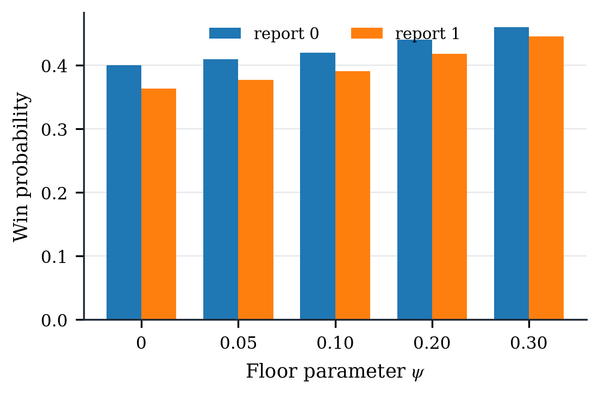
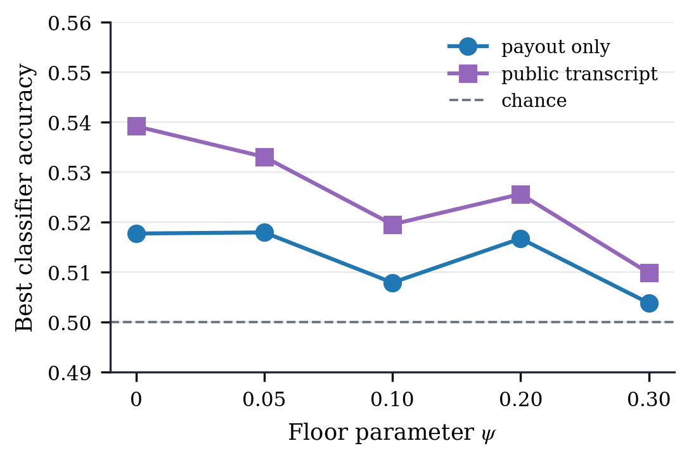
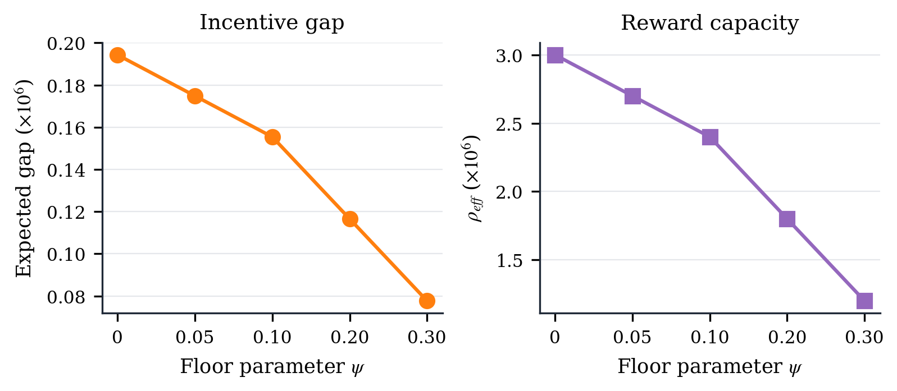

# ZK Peer-Incentive

This repository is a research prototype for incentive-private peer-prediction
rewards on top of encrypted blockchain dispute voting.

The prototype keeps official MACI unmodified for encrypted voting and tallying.
After MACI finishes, a reward sidecar commits to the final hidden reports,
proves a peer-prediction lottery reward computation in zero knowledge, verifies
that proof on Anvil, finalizes claimable balances, and lets recipients claim.

```text
encrypted MACI votes
  -> MACI process and tally proofs
  -> hidden binary reports from final MACI ballots
  -> reward sidecar state root
  -> reward proof
  -> reward finalization
  -> recipient claim
```

This is not production security software. It is an experimental artifact for a
paper: the useful claim is that a real ZK proof can bind reward payments to a
committed MACI-derived hidden report state, and that the paper's floor-adjusted
lottery model can be evaluated against public reward transcripts.

## What Is Implemented

The integrated local run uses official MACI to deploy contracts, sign up
voters, publish encrypted votes, process messages, generate a tally proof, and
verify the tally. The reward layer is separate. It builds leaves of the form:

```text
nonceCommitment_i = Poseidon(nonce_i, 0)
leaf_i = Poseidon(maciStateIndex_i, voterId_i, report_i,
                  nonceCommitment_i, stake_i, recipient_i)
```

The reward circuit verifies Merkle membership for every voter, so the private
reports and nonce openings used for reward computation are bound to the public
`finalRewardStateRoot`. Recipient addresses are part of the leaves, so the
proof also binds each payout coordinate to the address that can later claim it.

The circuit supports two lottery modes:

```text
baseline reward-correctness mode:
  q_i = x_i / rhoTau

floor-adjusted receipt-resistance mode:
  q_i = psi + (1 - 2 psi) * x_i / rhoTau
```

Here `x_i` is the smoothed inverse-frequency peer-agreement score, scaled by
`rhoTau`. The integrated default is floor-adjusted mode with `psi = 0.10`. The
circuit enforces `0 < psi < 1/2`, `q_i in [psi, 1 - psi]`, and:

```text
u_i       = low32(Poseidon(seed, i))
payout_i = rhoTau if u_i < q_i * 2^32, otherwise 0
```

Every public payout is therefore exactly `0` or `rhoTau`. The total payout is a
random variable. The pool is funded for maximum exposure, `N * rhoTau`, and
unpaid balance remains withdrawable by the owner after finalization.

The implementation does not exact-budget-normalize scores before the active
lottery. The legacy exact-budget/fixed-budget code and figures are retained as
a comparison baseline, but the current integrated contract uses coordinate-wise
Bernoulli payouts. The `rewardBudget` public input is an expected-payout cap,
not a rule that forces `sum_i payout_i` to equal a fixed budget.

Lottery randomness is derived from an external seed fixed after the reward root
is registered:

```text
seedCommitment = keccak256(seedPreimage, salt)
randomSeed     = keccak256(seedPreimage, salt,
                           disputeId, finalRewardStateRoot) mod Fr
seed           = Poseidon(disputeId, finalRewardStateRoot, randomSeed)
```

The local contract enforces the commit, root registration, and reveal order.
This is an experimental non-grinding interface. A production deployment would
replace or harden it with a beacon, VRF, or multi-party commit-reveal policy.
The per-coordinate draws `Poseidon(seed, i)` are computationally
pseudorandom, not statistically independent.

## Public Transcript Privacy

The paper studies public transcript privacy: a briber observes the payout
vector, proof public inputs, finalization transaction, claimable balances, and
other on-chain reward data, not only one voter's payout.

The prototype uses ring matching, `peer_i = (i + 1) mod N`. Flipping one hidden
report directly changes two peer-agreement coordinates: the voter itself and
the predecessor that uses that voter as a peer. The same-dispute leave-one-out
normalizer can also create smaller second-order changes in other coordinates.

For the integrated `N = 8` run, the repository reports both views:

```text
direct peer-graph exposure: D_graph = 2
measured public-payout coordinate exposure: max D_i = 8, average D_i = 7.237063
```

The measured `D_i` is an accounting report, not a complete privacy guarantee.
It counts public payout coordinates whose lottery probability changes when one
hidden report is flipped. The public root/id/seed fields are documented as
transcript fields, but the numeric `D_i` count is for payout coordinates.

## Current Local Result

Latest full local run, generated from the working tree:

```text
chain: Anvil, chain id 31337
voters: 8
MACI tally: option0 = 36, option1 = 36
reports: [1, 0, 1, 1, 0, 0, 1, 0]
reward mode: floor-adjusted Bernoulli lottery
psi: 0.10
rhoTau: 3,000,000
rho_eff: 2,400,000
maximum funded exposure: 24,000,000
Foundry tests: 16 passed
```

The reward circuit in the same run has:

```text
constraints: 30,164
public inputs: 34
private inputs: 112
```

Proof time and reward gas from the same Anvil run:

| Metric | Value |
| --- | ---: |
| MACI proof phase | `116.318 s` |
| Reward proof phase | `2.630 s` |
| Commit seed | `49,899 gas` |
| Register final reward root | `98,837 gas` |
| Reveal seed | `58,248 gas` |
| Fund reward pool | `47,418 gas` |
| Verify proof + finalize payouts | `584,313 gas` |
| Claim one payout | `30,729 gas` |

## Privacy Audit Snapshot

The synthetic privacy audit logs hidden reports only inside the experiment
harness so public payouts can be compared against ground truth. Production
reports remain private.

| Mode | `rho_eff` | Empirical `eta` | Transcript accuracy | Reward gap | Max `D_i` |
| --- | ---: | ---: | ---: | ---: | ---: |
| baseline | `3,000,000` | `0.036147` | `0.539185` | `194,293.61` | `8` |
| `psi = 0.05` | `2,700,000` | `0.032533` | `0.533058` | `174,864.25` | `8` |
| `psi = 0.10` | `2,400,000` | `0.028918` | `0.519555` | `155,434.89` | `8` |
| `psi = 0.20` | `1,800,000` | `0.021688` | `0.525618` | `116,576.16` | `8` |
| `psi = 0.30` | `1,200,000` | `0.014459` | `0.509848` | `77,717.44` | `8` |

In this synthetic workload, increasing `psi` reduces the difference between
public payout distributions for hidden reports, and it also reduces reward
capacity as predicted by `rho_eff = (1 - 2 psi) * rhoTau`.







More data and figure notes are in
[experiments/reward-evaluation/README.md](experiments/reward-evaluation/README.md).

Reward-layer-only scaling results for `N = 8, 16, 32, 64` are under
[results/](results/). These isolate the reward circuit and reward contracts;
they do not claim full MACI scalability for larger `N`.

## Running Locally

The reward-only Anvil flow checks the generated reward proof and reward
contracts without running full MACI:

```bash
cd poc
forge build
forge test -vvv
npm run e2e:anvil
```

The full MACI plus reward flow expects an official MACI checkout at
`/tmp/maci-official`, Node `v20.20.2`, MACI test zkeys, rapidsnark, Foundry, and
the reward circuit artifacts under `poc/artifacts/v2/`. Setup notes are in
[poc/maci_baseline.md](poc/maci_baseline.md).

```bash
cd poc
MACI_REPO=/tmp/maci-official npm run e2e:full-maci-reward:anvil
```

To regenerate the reward evaluation data and figures:

```bash
cd poc
python3 -m venv .venv
. .venv/bin/activate
pip install -r requirements.txt
npm run experiments:reward
```

For just the privacy audit:

```bash
cd poc
. .venv/bin/activate
npm run experiments:privacy-audit
```

The reward artifact builder reads the mode from sidecar input JSON. Use:

```json
{ "lotteryMode": "baseline", "psiScaled": "0" }
```

for baseline reward-correctness mode, or:

```json
{ "lotteryMode": "floor_adjusted", "psiScaled": "429496729" }
```

for floor-adjusted mode with `psi = 0.10`. The checked-in generated verifier
fixture and full MACI Anvil script use the floor-adjusted setting by default.

The main audit outputs are:

```text
experiments/reward-evaluation/data/privacy_audit_samples.csv
experiments/reward-evaluation/data/privacy_audit_summary.csv
experiments/reward-evaluation/data/privacy_audit_exposure.csv
experiments/reward-evaluation/data/privacy_audit_selective_bribery.csv
experiments/reward-evaluation/figures/privacy_*.pdf
experiments/reward-evaluation/figures/privacy_*.png
```

## Scope

This repository is a fixed-size local prototype. The integrated MACI/reward run
uses `N = 8`; the standalone capacity experiment compiles a max-size reward
circuit up to `N_max = 64`. MACI remains unmodified, so the reward nonce bridge
uses sidecar data derived from MACI command salts rather than a dedicated MACI
message field.

Out of scope: production audit, production randomness policy, Sybil resistance,
registration policy, live fee estimation, human-effort validation, and a proof
that voters were actually truthful. The reward layer proves payout correctness
from committed hidden inputs under the chosen rule.
