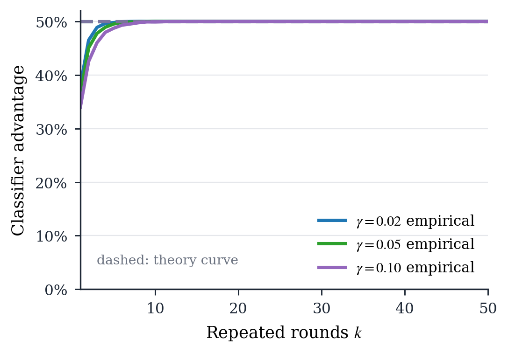

# ZK Peer-Incentive

This repository is a research prototype for incentive-private peer-prediction
rewards on top of encrypted blockchain dispute voting.

The prototype keeps official MACI unmodified for encrypted voting and tallying.
After MACI finishes, a reward sidecar commits to the final hidden reports,
proves a peer-prediction lottery reward computation in zero knowledge, verifies
that proof on Anvil, finalizes claimable balances, and lets recipients claim.

```text
encrypted MACI votes
  -> MACI process and tally proofs
  -> hidden binary reports from final MACI ballots
  -> reward sidecar state root
  -> reward proof
  -> reward finalization
  -> recipient claim
```

This is not production security software. It is an experimental feasibility
artifact for a paper: the useful claim is that a real ZK proof can bind reward
payments to a committed MACI-derived hidden report state.

## What Is Implemented

The integrated local run uses official MACI to deploy contracts, sign up
voters, publish encrypted votes, process messages, generate a tally proof, and
verify the tally. The reward layer is separate. It builds leaves of the form:

```text
nonceCommitment_i = Poseidon(nonce_i, 0)
leaf_i = Poseidon(maciStateIndex_i, voterId_i, report_i,
                  nonceCommitment_i, stake_i, recipient_i)
```

The reward circuit verifies Merkle membership for every voter, so the private
reports and nonce openings used for reward computation are bound to the public
`finalRewardStateRoot`. Recipient addresses are also part of the leaves, so the
proof binds each payout coordinate to the address that can later claim it.

The current reward rule is coordinate-wise Bernoulli lottery, not exact-budget
normalization:

```text
x_i          = smoothed inverse-frequency peer-agreement score
raw_i        = floor(x_i * 2^32 / rhoTau)
threshold_i  = clamp(raw_i, gammaScaled, 2^32 - gammaScaled)
u_i          = low32(Poseidon(seed, i))
payout_i     = rhoTau if u_i < threshold_i, otherwise 0
```

Therefore every public payout is exactly `0` or `rhoTau`. The total payout is a
random variable. The pool is funded for maximum exposure, `N * rhoTau`, and
unpaid balance remains withdrawable by the owner after finalization. The
`rewardBudget` public input is used as an expected-payout cap, not as a rule
that forces `sum_i payout_i` to equal a fixed budget.

Lottery randomness is derived from an external seed fixed after the reward root
is registered:

```text
seedCommitment = keccak256(seedPreimage, salt)      // committed before root
randomSeed     = keccak256(seedPreimage, salt,
                           disputeId, finalRewardStateRoot) mod Fr
seed           = Poseidon(disputeId, finalRewardStateRoot, randomSeed)
```

The local contract enforces the commit, root registration, and reveal order.
This gives a clean experimental interface for non-grindable randomness. A
production deployment would replace or harden this with a beacon, VRF, or
multi-party commit-reveal policy.

The per-coordinate draws are separated as `Poseidon(seed, i)`; this is a
computational pseudorandomness assumption, not statistical independence.

## Privacy Shape

The paper now studies public transcript privacy: a briber sees the full payout
vector, proof public inputs, finalization transaction, claimable balances, and
other on-chain reward data.

The prototype uses ring matching, `peer_i = (i + 1) mod N`. Flipping one hidden
report directly changes two peer-agreement coordinates: the voter itself and
the predecessor that uses that voter as a peer. The same-dispute leave-one-out
normalizer can also create smaller second-order changes in other coordinates.

For the integrated `N = 8` run, the repository reports both views:

```text
direct peer-graph exposure: D_graph = 2
conservative public-transcript coordinate count: up to 8 coordinates
```

The generated exposure data measures how much each Bernoulli probability
`q_j` changes when one report is flipped. With the current profile, the largest
direct change is `0.90` at `gamma = 0.05`, while the largest observed
second-order change is `0.18882766`. See
`experiments/reward-evaluation/data/exposure_probability_sanity.csv`.

## Current Local Result

Latest full local run, generated from the working tree based on commit
`e8cf1a4`:

```text
chain: Anvil, chain id 31337
voters: 8
MACI tally: option0 = 36, option1 = 36
reports: [1, 0, 1, 1, 0, 0, 1, 0]
reward mode: coordinate-wise Bernoulli lottery
rhoTau: 3,000,000
gamma: 0.05
payouts: [0, 0, 3000000, 0, 0, 0, 0, 0]
total payout in this draw: 3,000,000
maximum funded exposure: 24,000,000
Foundry tests: 16 passed
```

The reward circuit in the same run has:

```text
constraints: 26,080
public inputs: 33
private inputs: 96
```

Proof time and reward gas from the same Anvil run:

| Metric | Value |
| --- | ---: |
| MACI proof phase | `124.084 s` |
| Reward proof phase | `4.618 s` |
| Commit seed | `49,899 gas` |
| Register final reward root | `98,837 gas` |
| Reveal seed | `58,248 gas` |
| Fund reward pool | `47,396 gas` |
| Verify proof + finalize payouts | `557,212 gas` |
| Claim one payout | `30,707 gas` |

The gamma floor contributes a minimum expected payout mass of
`N * gamma * rhoTau = 8 * 0.05 * 3,000,000 = 1,200,000` in the integrated run.

## Evaluation

The evaluation artifacts are under `experiments/reward-evaluation/`. The main
figures answer practical questions rather than claiming production readiness.

End-to-end overhead compares MACI proving, reward proving, and reward-layer gas:


Reward sensitivity and lottery confidence show how the peer-prediction rule
changes lottery concentration as `kappa` changes. Here `kappa` is the reward
scale: larger values make peer-agreement scores translate into higher lottery
probabilities.


Attack simulation samples the full public payout transcript for two worlds
that differ by one target report. It compares an optimal likelihood-ratio
classifier against the clipped theoretical advantage curve for
`gamma in {0.02, 0.05, 0.10}`. In the current high-signal parameter setting, the
empirical advantage reaches the 50% ceiling after repeated rounds, so the plot
is best read as a parameter-sanity warning rather than a deployment claim.



The fixed-budget allocation figure is retained as a comparison baseline for
the older exact-budget mode. It is not the payout rule used by the current
integrated reward contract.


Reward gas and operating cost projections isolate reward-layer operating cost.
Deployment is excluded.

| Claimants | Ethereum L1, 20 gwei | Arbitrum execution, 0.1 gwei |
| ---: | ---: | ---: |
| 10 | `$69.76` | `$0.35` |
| 100 | `$354.38` | `$1.77` |
| 1000 | `$3,200.56` | `$16.00` |


More detail, including data-file descriptions and reproduction commands, is in
[experiments/reward-evaluation/README.md](experiments/reward-evaluation/README.md).

## Running Locally

The reward-only Anvil flow checks the generated reward proof and reward
contracts without running full MACI:

```bash
cd poc
forge build
forge test -vvv
npm run e2e:anvil
```

The full MACI plus reward flow expects an official MACI checkout at
`/tmp/maci-official`, Node `v20.20.2`, MACI test zkeys, rapidsnark, Foundry, and
the reward circuit artifacts under `poc/artifacts/v2/`. Setup notes are in
[poc/maci_baseline.md](poc/maci_baseline.md).

```bash
cd poc
MACI_REPO=/tmp/maci-official npm run e2e:full-maci-reward:anvil
```

To regenerate the reward evaluation data and figures:

```bash
cd poc
python3 -m venv .venv
. .venv/bin/activate
pip install -r requirements.txt
npm run experiments:reward-data
npm run experiments:attack-simulation
npm run experiments:reward-scaling
npm run experiments:reward-plots
```

## Scope

This repository is a fixed-size local prototype. The integrated MACI/reward run
uses `N = 8`; the standalone capacity experiment compiles a max-size reward
circuit up to `N_max = 64`. MACI remains unmodified, so the reward nonce bridge
uses sidecar data derived from MACI command salts rather than a dedicated MACI
message field.

Out of scope: production audit, production randomness policy, Sybil resistance,
registration policy, live fee estimation, human-effort validation, and a proof
that voters were actually truthful. The reward layer proves payout correctness
from committed hidden inputs under the chosen rule.
