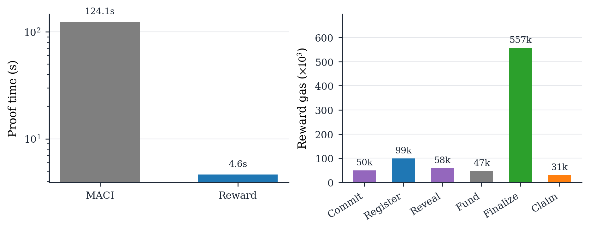
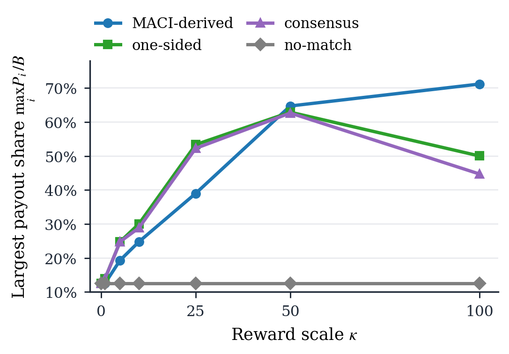
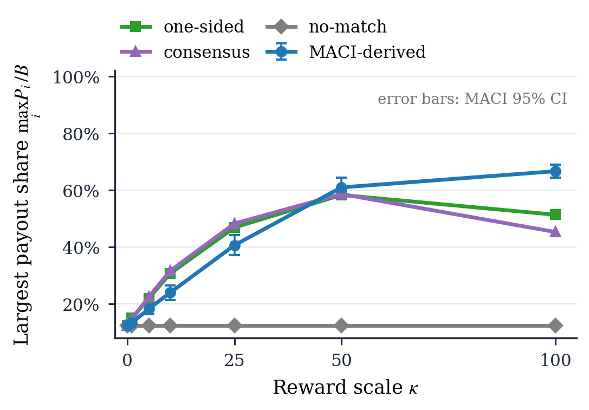
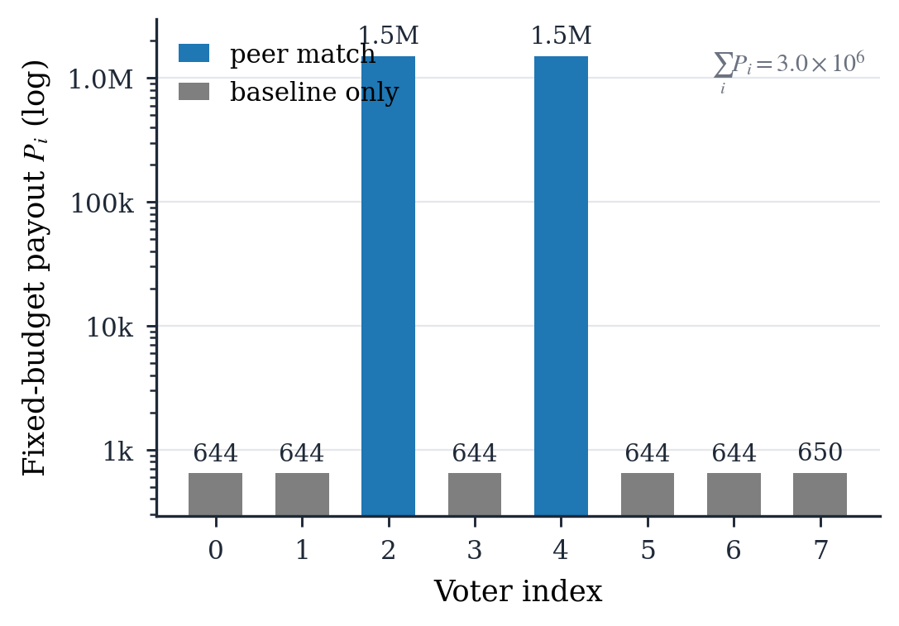
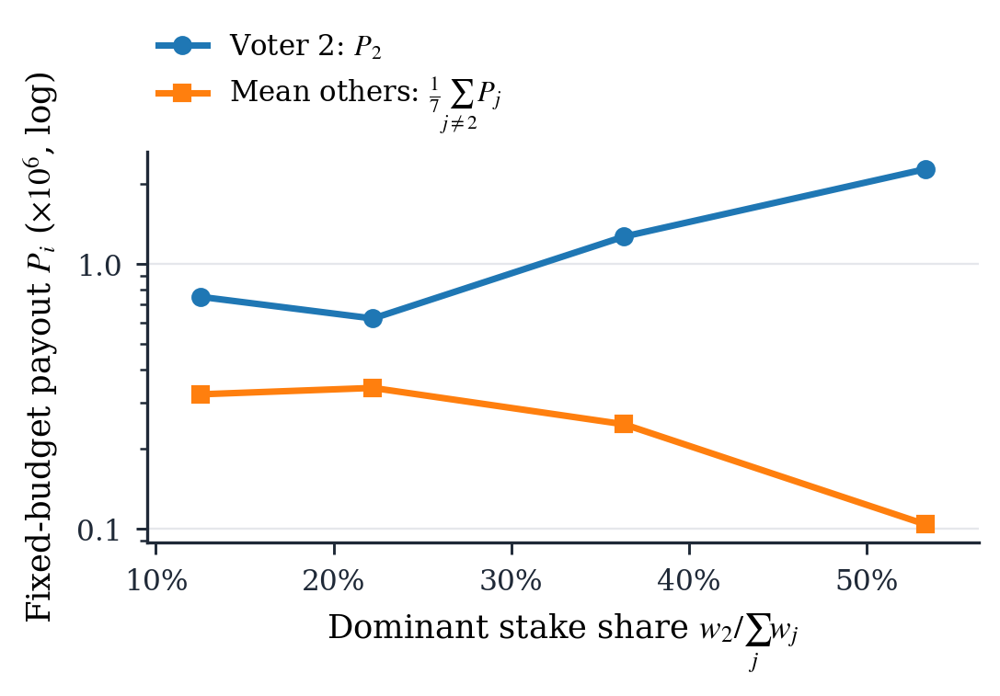
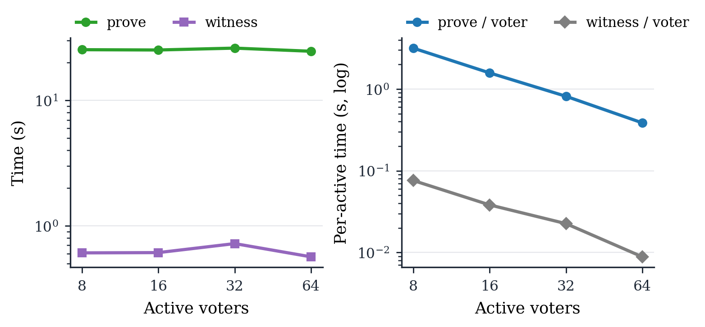
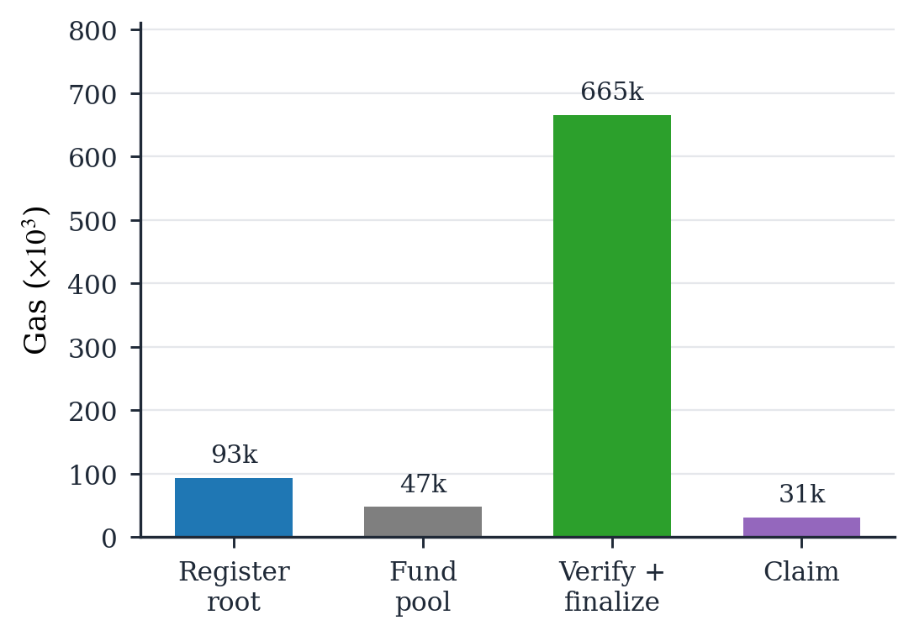
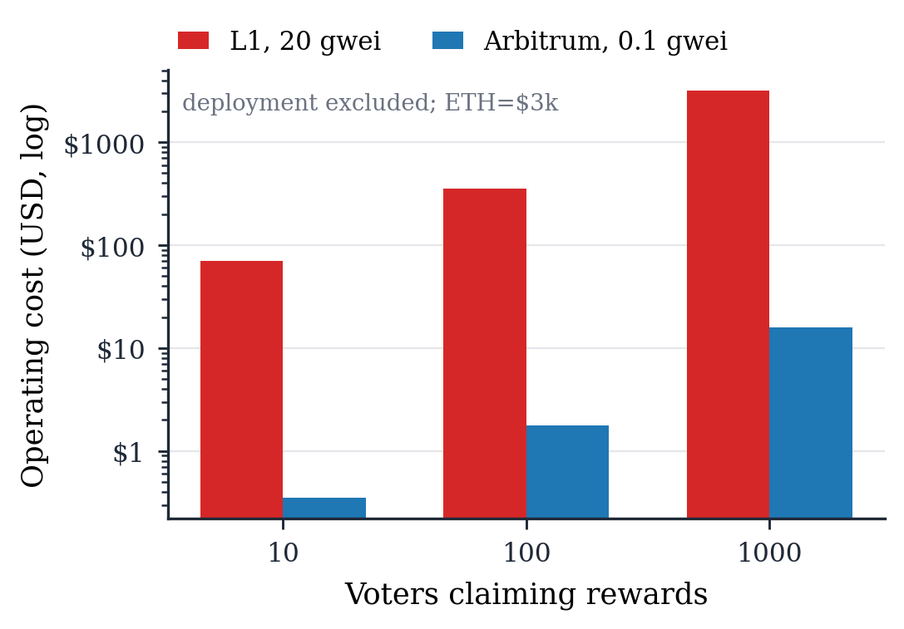

# ZK Peer-Prediction Reward PoC

This repository is a research prototype for adding a ZK-verifiable
peer-prediction reward layer to private MACI voting.

MACI is used for what it already does well: voters submit encrypted votes, the
system processes those messages privately, and a tally proof verifies the final
result without exposing each voter's vote. This PoC adds a separate reward
sidecar. The sidecar takes the final hidden voting state, commits the
reward-relevant data into a root, proves that a fixed-budget peer-prediction
payout vector was computed correctly, and lets recipients claim the finalized
rewards on-chain.

```text
encrypted MACI votes
  -> MACI message-processing proof
  -> MACI tally proof
  -> hidden binary reports from final MACI ballots
  -> reward state root
  -> reward proof
  -> on-chain reward finalization
  -> recipient claim
```

The implementation lives under `poc/`. The goal is feasibility for research,
not production security.

## Core Idea

The prototype keeps official MACI unmodified. MACI handles signup, poll join,
encrypted vote publication, message processing, tally proving, and on-chain
tally verification. After MACI finishes, the reward sidecar derives binary
reports from the final MACI ballots and builds a reward state root.

Each reward leaf binds the hidden report to the MACI state index, a voter
identity value, a nonce commitment, a public stake, and the recipient address:

```text
nonceCommitment_i = Poseidon(nonce_i, 0)
leaf_i = Poseidon(maciStateIndex_i, voterId_i, report_i, nonceCommitment_i, stake_i, recipient_i)
```

The reward proof then shows that the prover knows hidden reports and nonce
openings included in that root, and that the public payout vector follows the
fixed-budget lottery reward rule. The Solidity reward pool checks the proof,
checks that the root is the registered final reward state, records claimable
balances, and lets each recipient withdraw their assigned payout.

The claim supported by the PoC is intentionally narrow:

> A reward layer can be bound to a MACI-derived hidden report state, and a real
> Groth16 proof can verify fixed-budget peer-prediction payouts before an
> on-chain claim flow pays recipients.

## Reward Rule

The current reward rule is fixed-size and intentionally simple: `N = 8`, binary
reports, public stakes, ring peer matching, and smoothed inverse-frequency peer
agreement. The mechanism first computes an expected peer-prediction score `T_i`
for each voter. A private nonce-derived lottery draw then selects winners with
probability approximately `T_i / rhoTau`.

```text
seed_0 = Poseidon(disputeId, finalRewardStateRoot)
seed_{i+1} = Poseidon(seed_i, nonce_i)
seed = seed_N
u_i = low32(Poseidon(seed, i))
win_i = 1 if u_i * rhoTau < T_i * 2^32, else 0
active_i = 1 if stake_i > 0, else 0
score_i = active_i * scale + win_i * rhoTau
payout_i ~= B * score_i / sum_j score_j
sum_i payout_i = B
```

The lottery decides who receives the large allocation score, but the final
payout vector is still normalized into the configured fixed budget `B`. The last
payout receives the integer rounding residue, so the payout vector always sums
exactly to the budget.

Here, `kappa` is the reward scale. Increasing `kappa` makes peer-agreement
scores larger before the lottery threshold step. It does not create a larger
reward pool; it changes the chance that a peer-matching voter becomes a lottery
winner.

## Current Result

The latest full local run uses official MACI at commit
`22106c8a2015f18709a32208ad2ad40b6f3fa8a5`, an Anvil chain with chain id
`31337`, eight voters, and a reward budget of `3,000,000`.

```text
MACI tally: option0 = 36, option1 = 36
reports: [1, 0, 1, 1, 0, 0, 1, 0]
lottery wins: [0, 0, 1, 0, 1, 0, 0, 0]
payouts: [499, 499, 1498501, 499, 1498501, 499, 499, 503]
MACI proof phase: 86652 ms
reward proof phase: 3043 ms
reward circuit: 25,512 constraints, 31 public inputs, 88 private inputs
Foundry tests: 13 passed
```

Reward-specific gas from the same run was:

```text
registerFinalState   93,322 gas
fundDispute          47,396 gas
finalizeRewards     671,990 gas
claim                30,684 gas
```

`finalizeRewards` is the expensive reward-layer operation because it verifies
the Groth16 proof and records the payout vector. `claim` is cheap because it
only withdraws a balance that was already finalized.

## Evaluation

The evaluation artifacts are under `experiments/reward-evaluation/`. They are
meant to support the basic research questions: whether the full MACI plus reward
flow runs end to end, whether the fixed-budget reward rule behaves sensibly
under representative report profiles, how stake weighting affects payout share,
and what the reward-only on-chain cost looks like.

End-to-end overhead:

This graph compares the full MACI proof phase with the reward proof phase and
summarizes the reward-layer gas costs from the same Anvil run. It shows that the
reward proof is small relative to the MACI proving phase in this local setup,
while on-chain reward finalization is dominated by proof verification and payout
recording.



Reward-scale sensitivity:

This graph shows a lottery-aware final-payout metric averaged over deterministic
seed samples: the largest single payout divided by the fixed budget. At
`kappa = 0`, everyone gets an equal baseline share. As `kappa` increases,
profiles with peer matches are more likely to produce lottery winners, so the
fixed budget concentrates on fewer voters. The no-match profile stays at the
equal baseline because no voter can win the reward lottery.



Lottery confidence:

This graph repeats the reward-scale experiment over 512 deterministic lottery
samples. The MACI-derived line includes a 95% confidence interval for the mean,
separating the average behavior from the randomness of any single draw.



Fixed-budget allocation:

This graph shows one fixed-budget lottery realization for the MACI-derived
report profile. The y-axis is logarithmic so both the winner payout and the
small baseline payouts remain visible. A peer match creates lottery eligibility;
the lottery draw decides which eligible voters become winners in that seed.



Stake weighting:

This graph is the only one that changes stake. It changes voter 2's public stake
while keeping the report pattern fixed and averages over deterministic lottery
seeds. It checks that, when a voter has a valid peer-agreement signal,
increasing that voter's stake increases expected payout share.



Reward capacity utilization:

This graph fixes one reward circuit at `N_max = 64` and proves inputs with
`8, 16, 32, 64` active voters. It shows the practical tradeoff of a capacity
circuit: total proof time stays near the fixed max-size cost, while per-active
voter overhead improves as the poll fills.



Reward gas:

This graph separates the reward-layer on-chain costs. `Verify + finalize` is
the largest bar because it verifies the reward proof and records the payout
vector. `Claim` is much smaller because it only withdraws an already-finalized
balance.



Operating cost projection:

This graph projects reward-layer operating cost for 10, 100, and 1000 claimants
using the measured gas model. Deployment is excluded. The Arbitrum row is an
execution-gas-only illustrative model, so it should be read as a scenario rather
than a live fee quote.

| Claimants | Ethereum L1, 20 gwei | Arbitrum execution, 0.1 gwei |
| ---: | ---: | ---: |
| 10 | `$69.81` | `$0.35` |
| 100 | `$354.31` | `$1.77` |
| 1000 | `$3,199.24` | `$16.00` |

Assumptions: ETH at `$3,000`, deployment excluded, one finalization, and every
recipient claims once.



The same figures are also exported as vector PDFs for paper or slide use. More
detail is in [experiments/reward-evaluation/README.md](experiments/reward-evaluation/README.md).

## Running The Prototype

The reward-only Anvil flow checks the generated reward proof and reward
contracts without running full MACI:

```bash
cd poc
forge build
forge test -vvv
npm run e2e:anvil
```

The full MACI plus reward flow expects an official MACI checkout at
`/tmp/maci-official`, Node `v20.20.2`, MACI test zkeys, rapidsnark, Foundry, and
the reward circuit artifacts under `poc/artifacts/v2/`. The exact setup is
documented in [poc/maci_baseline.md](poc/maci_baseline.md).

```bash
cd poc
MACI_REPO=/tmp/maci-official npm run e2e:full-maci-reward:anvil
```

That command starts Anvil, deploys official MACI, signs up and joins eight
voters, publishes encrypted votes, generates and submits MACI proofs, derives
the reward sidecar state, generates the reward proof, finalizes payouts, and
claims one payout.

To regenerate the evaluation data and figures:

```bash
cd poc
python3 -m venv .venv
. .venv/bin/activate
pip install -r requirements.txt
npm run experiments:reward-data
npm run experiments:reward-scaling
npm run experiments:reward-plots
```

## Scope

This is a local research prototype with binary reports, a local development
Groth16 setup, and an experimental reward sidecar around official MACI. The
integrated Anvil flow is fixed at `N = 8`; the reward capacity-utilization
experiment uses a standalone `N_max = 64` circuit with zero-stake padding. It
does not include a production audit, Sybil-resistance policy, token-economics
design, or proof of real-world human effort.

MACI remains responsible for private voting and tally correctness. The new
reward proof is responsible only for payout correctness from committed hidden
reports.

For deeper technical details, see [poc/zk_relation.md](poc/zk_relation.md),
[poc/maci_baseline.md](poc/maci_baseline.md), and
[experiments/reward-evaluation/README.md](experiments/reward-evaluation/README.md).
