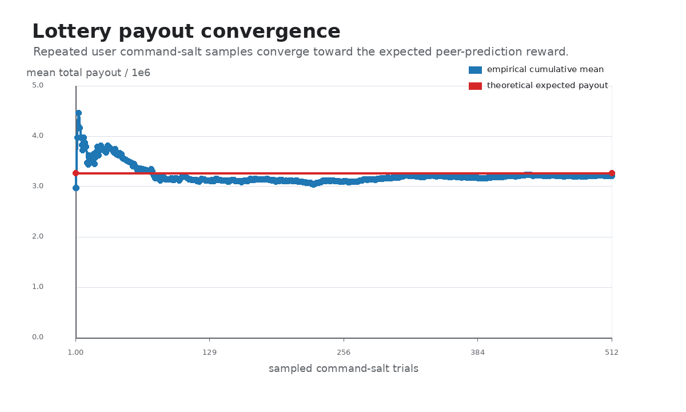

# ZK Peer-Prediction Reward PoC

This repository contains a research prototype that connects official MACI with
a ZK-verifiable peer-prediction reward layer.

In plain terms:

```text
private MACI votes
  -> verified MACI tally
  -> hidden binary reports derived from final MACI ballots
  -> ZK-verified peer-prediction lottery rewards
  -> on-chain reward finalization
  -> winner claim
```

The implementation currently lives under `poc/`. The focus is feasibility:
showing that private MACI outputs can feed a reward proof and an on-chain reward
claim flow.

## Purpose

MACI proves that encrypted votes were processed and tallied correctly without
revealing each voter's individual vote.

This PoC asks a follow-up question:

> Can a reward mechanism be attached to that private final voting state, so that
> rewards are verifiably correct without revealing the hidden reports?

The current answer demonstrated by this repository is:

> Yes, as an experimental reward sidecar. Unmodified official MACI handles
> voting and tallying; a separate reward proof proves that the payout vector was
> computed correctly from reports bound to a MACI-derived reward state root.

## What It Does

The system currently supports:

- real official MACI local flow:
  - voter signup;
  - poll join;
  - encrypted vote publication;
  - MACI message-processing proof generation and on-chain submission;
  - MACI tally proof generation and on-chain verification;
- reward sidecar state:
  - derives binary reports from final MACI ballots;
  - binds reports to `maciStateIndex`, voter identity value, nonce commitment,
    public stake, and recipient address;
  - commits those leaves into a Merkle root;
- reward proof:
  - proves hidden reports and nonces are bound to the reward sidecar root;
  - computes inverse-frequency peer-agreement rewards;
  - converts expected rewards into lottery payouts;
  - exposes public payout values, recipient addresses, poll/dispute id, reward
    state root, and reward parameters;
- Solidity reward flow:
  - verifies the generated Groth16 proof on-chain;
  - checks the proof root matches the registered reward state root;
  - checks payout recipient addresses match proof public signals;
  - records claimable rewards;
  - allows winners to claim.

## System Components

### Official MACI

The MACI side uses the official repository:

- repo: `https://github.com/privacy-scaling-explorations/maci`
- pinned commit: `22106c8a2015f18709a32208ad2ad40b6f3fa8a5`
- package version at that commit: `maci@3.0.0`

MACI is not vendored into this repository. The integration script expects an
external checkout, usually at `/tmp/maci-official`.

MACI provides:

- encrypted voting;
- message processing proof;
- tally proof;
- on-chain tally verification;
- final off-chain poll state from which the reward sidecar derives reports.

### Reward Sidecar

The reward sidecar is the new part in this repository.

For each voter, the sidecar leaf is:

```text
nonceCommitment_i = Poseidon(nonce_i, 0)
leaf_i = Poseidon(maciStateIndex_i, voterId_i, report_i, nonceCommitment_i, stake_i, recipient_i)
```

The Merkle root of these leaves is the public reward state root.

The reward proof attests:

```text
The prover knows hidden reports and nonces such that:
1. each report is binary;
2. each nonce opens to its nonce commitment;
3. all leaves are included in the public reward state root;
4. each public recipient address is bound to the same leaf as the hidden report;
5. the public payout vector follows the peer-prediction lottery rule.
```

### Reward Contracts

Important contracts:

- `poc/contracts/RewardGroth16Verifier.sol`: generated snarkjs verifier for the
  reward circuit.
- `poc/contracts/RewardVerifierAdapter.sol`: adapts `bytes` proof input to the
  generated verifier ABI.
- `poc/contracts/FinalStateRegistry.sol`: stores `poll/dispute id`, reward state
  root, tally placeholder, and MACI tally verification status.
- `poc/contracts/IntegratedRewardPool.sol`: verifies reward proof, finalizes
  payout amounts, and lets winners claim.

The reward payout flow is pull-based:

```text
finalizeRewards() -> records claimable balances
claim()           -> each winner withdraws their own balance
```

This avoids sending ETH to every recipient during finalization.

## Reward Rule

The PoC uses:

- binary reports: `0` or `1`;
- fixed `N = 8`;
- public stakes;
- ring peer matching: `peer(i) = i + 1 mod N`;
- smoothed leave-one-out inverse-frequency peer agreement;
- high-entropy private nonces sourced from MACI `VoteCommand.salt` values;
- a lottery draw from `Poseidon(seed, i)`.

The lottery seed is:

```text
seed = Poseidon(commandSalt_0, ..., commandSalt_7, pollId, finalRewardStateRoot)
```

In the full MACI experiment, each `commandSalt_i` is the salt inside the user's
encrypted and signed MACI vote command. The reward proof opens those salts
privately as lottery entropy. This keeps official MACI unchanged while tying the
reward nonce source to the encrypted vote command path.

Each participant either receives:

```text
rhoTau
```

or:

```text
0
```

depending on whether their lottery draw falls below the threshold implied by
their expected peer-prediction reward.

## How To Run

### Reward-Only Anvil Flow

This checks the generated reward proof and reward contracts on Anvil.

```bash
cd poc
forge build
forge test -vvv
npm run e2e:anvil
```

The script starts Anvil automatically if `RPC_URL` is not set.

### Full MACI + Reward On Anvil

This runs official MACI and the reward layer on an Anvil JSON-RPC chain.

Prerequisites:

- official MACI repo prepared at `/tmp/maci-official`;
- Node `v20.20.2` available through `nvm`;
- MACI test zkeys downloaded;
- rapidsnark installed as described in `poc/maci_baseline.md`;
- Foundry tools `forge`, `anvil`, and `cast` available;
- reward circuit artifacts already generated under `poc/artifacts/v2/`.

Command:

```bash
cd poc
MACI_REPO=/tmp/maci-official npm run e2e:full-maci-reward:anvil
```

What it does:

- starts Anvil on `http://127.0.0.1:8556`;
- temporarily points the official MACI testing config at that Anvil RPC;
- deploys official MACI contracts;
- signs up and joins 8 voters;
- publishes 8 encrypted votes;
- generates and submits MACI proofs;
- verifies MACI tally;
- derives reward sidecar state;
- generates reward proof;
- deploys reward contracts;
- finalizes rewards;
- claims one winning payout;
- restores the official MACI testing config afterward.

### Full MACI + Reward On MACI Hardhat Harness

The same integration can run on the official MACI in-process Hardhat chain:

```bash
cd poc
MACI_REPO=/tmp/maci-official npm run e2e:full-maci-reward
```

## Evaluation Results

Latest full MACI + reward Anvil run after recipient binding, MACI command-salt
nonce sourcing, and range-check additions:

```text
execution chain id: 31337
MACI tally option 0: 36
MACI tally option 1: 36
total spent voice credits: 648
derived reports: [1, 0, 1, 1, 0, 0, 1, 0]
finalRewardStateRoot:
  5918709685620845749538721862743514405600246650950154740349407238551684212180
reward nonce source: MACI VoteCommand.salt
reward winner indices: [2, 4]
MACI proof phase: 112450 ms
reward proof phase: 919 ms
```

Reward-related gas from the Anvil run:

```text
registerFinalState   93,334 gas
fundDispute          47,396 gas
finalizeRewards     545,197 gas
claim                30,706 gas
```

Reward contract deployment gas:

```text
RewardGroth16Verifier   937,075 gas
RewardVerifierAdapter   328,329 gas
FinalStateRegistry      365,305 gas
IntegratedRewardPool  1,193,529 gas
```

Foundry tests:

```text
13 tests passed
```

The tests cover:

- valid generated reward proof accepted on-chain;
- wrong reward state root rejected;
- wrong poll/dispute id rejected;
- tampered payout rejected;
- tampered proof rejected;
- unverified MACI tally status rejected;
- recipient address substitution rejected;
- double finalization rejected;
- winner claim succeeds;
- double claim fails through cleared claimable balance.

Circuit size:

```text
23,875 non-linear constraints
30 public inputs
80 private inputs
```

## Experimental Figures

Reproducible evaluation data and figures live under
`experiments/reward-evaluation/`.

Generate them with:

```bash
cd poc
python3 -m venv .venv
. .venv/bin/activate
pip install -r requirements.txt
npm run experiments:reward
```

The evaluation is organized around the main claims of the prototype:

| Claim being checked | Experiment | Evidence |
| --- | --- | --- |
| Does official MACI plus the reward layer run end to end? | Full MACI + reward Anvil run | `full_maci_reward_anvil_latest.json`, proof time, gas data |
| Does the single peer-prediction reward rule behave as intended? | Reward-rule behavior sweep | Same rule under MACI-derived, one-sided, consensus, and alternating report profiles |
| Is the sparse lottery payout aligned with expected reward? | Salt-vector lottery trials | Empirical mean payout converges toward theoretical expected payout |
| Do public stakes affect reward allocation as intended? | Stake concentration sweep | Dominant-stake reward and non-dominant average reward |
| What is the reward-layer on-chain cost? | Gas breakdown | Root registration, funding, proof verification plus finalization, and claim gas |

More detail is in
[experiments/reward-evaluation/README.md](experiments/reward-evaluation/README.md).

The data files are CSV/JSON:

- `experiments/reward-evaluation/data/parameter_sweep.csv`
- `experiments/reward-evaluation/data/reward_sensitivity.csv`
- `experiments/reward-evaluation/data/lottery_trials.csv`
- `experiments/reward-evaluation/data/stake_concentration.csv`
- `experiments/reward-evaluation/data/gas_breakdown.csv`
- `experiments/reward-evaluation/data/reward_only_gas_breakdown.csv`
- `experiments/reward-evaluation/data/anvil_reward_e2e_latest.json`
- `experiments/reward-evaluation/data/full_maci_reward_anvil_latest.json`

The same plots are exported as PNG previews for README and PDF files for paper
or slide use. The PDFs are vector figures with embedded fonts.

Reward-rule behavior: the same peer-prediction rule is evaluated under several
representative report profiles while the incentive scale changes. This is a
calibration and implementation-check plot: it shows whether the implemented
rule responds to agreement patterns and scale choices in the direction expected
by the mechanism design.


PDF: [reward_sensitivity.pdf](experiments/reward-evaluation/figures/reward_sensitivity.pdf)

Lottery payout convergence: repeated deterministic salt-vector samples show that
the average realized jackpot payout tracks the theoretical expected reward.



PDF: [lottery_unbiasedness.pdf](experiments/reward-evaluation/figures/lottery_unbiasedness.pdf)

Stake-weighting behavior: increasing one voter's public stake scales that
voter's expected reward and shows how stake-weighted incentives enter the rule.


PDF: [stake_concentration.pdf](experiments/reward-evaluation/figures/stake_concentration.pdf)

Reward on-chain cost: reward-layer gas only, separated into state registration,
funding, proof verification plus finalization, and winner claim.


PDF: [cost_profile.pdf](experiments/reward-evaluation/figures/cost_profile.pdf)

## Generated Artifacts

Committed deterministic vectors:

- `poc/vectors/v2/reward_lottery_state.json`
- `poc/vectors/v2/reward_proof_fixture.json`

Ignored reproducible artifacts:

- `poc/artifacts/v2/input.json`
- `poc/artifacts/v2/reward_check.r1cs`
- `poc/artifacts/v2/reward_check_js/reward_check.wasm`
- `poc/artifacts/v2/witness.wtns`
- `poc/artifacts/v2/proof.json`
- `poc/artifacts/v2/public.json`
- `poc/artifacts/v2/verification_key.json`
- `poc/artifacts/v2/reward_check_final.zkey`
- `poc/artifacts/full_maci_reward_anvil/`

The ignored artifacts are large or environment-specific and can be regenerated.

## Repository Map

```text
poc/reference/reward_model.js
  JavaScript reference model for reward computation, lottery payouts, and
  Merkle sidecar state.

poc/circuits/reward_check.circom
  Circom reward relation proving payout correctness and reward state inclusion.

poc/contracts/
  Solidity verifier adapter, reward pool, and final-state registry.

poc/scripts/build_sidecar_reward_artifacts.js
  Builds reward proof artifacts from MACI-derived sidecar inputs.

poc/scripts/run_full_maci_reward_e2e.js
  Runs official MACI plus reward integration on Hardhat or Anvil.

experiments/reward-evaluation/
  Parameter sweep data, Anvil gas data, and generated PNG/PDF figures.

poc/maci_baseline.md
  Exact official MACI setup, pinned versions, commands, and Anvil details.

poc/zk_relation.md
  More formal description of the reward ZK relation.
```

## Supported Claim

A successful run supports this claim:

> A MACI final voting state can be used as the source for hidden binary reports;
> a reward sidecar can bind those reports to a public root; and a Groth16 proof
> can verify peer-prediction lottery payouts from that hidden state before a
> Solidity contract finalizes claimable rewards.

This is a reward-layer extension around MACI. MACI remains responsible for
private voting and tally correctness; the new proof handles reward correctness
from the committed hidden report state.

## Current Scope

- Fixed-size `N = 8`, binary-report prototype with a local development Groth16
  setup.
- Official MACI is used unchanged; the reward sidecar and command-salt nonce
  bridge are experimental integration choices.
- Registration policy, Sybil resistance, token design, scaling, and production
  audit are outside this prototype.
- The proof verifies payout correctness from committed hidden reports; it does
  not cryptographically prove real-world effort.
