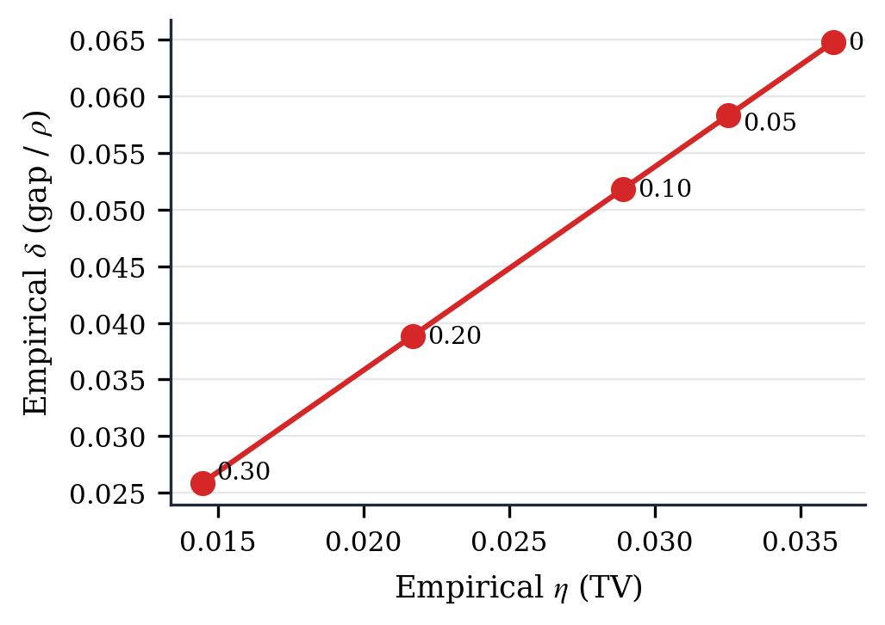
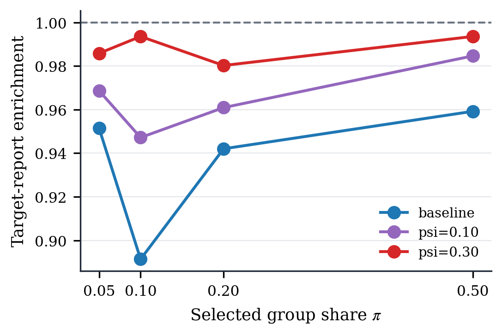
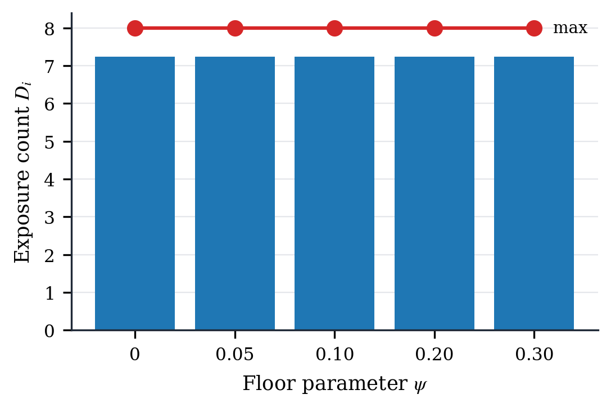

# Reward Evaluation

This directory contains the data and figures used to evaluate the experimental
MACI reward sidecar. The current implementation is a coordinate-wise Bernoulli
lottery over hidden binary reports, with a switch between baseline reward
correctness and floor-adjusted receipt resistance.

The evaluation supports a narrow claim: official MACI can run a local encrypted
voting flow, and a separate Groth16 reward proof can bind hidden reports to a
reward state root, verify floor-adjusted lottery payouts, and finalize
claimable balances on Anvil. It is not a production security claim.

## Modes

The circuit exposes `lotteryMode` and `psiScaled`.

```text
lotteryMode = 0: baseline reward-correctness mode
q_i = x_i / rhoTau

lotteryMode = 1: floor-adjusted receipt-resistance mode
q_i = psi + (1 - 2 psi) * x_i / rhoTau
```

`psiScaled = floor(psi * 2^32)`. Baseline mode requires `psiScaled = 0`.
Floor-adjusted mode requires `0 < psi < 1/2` and the circuit enforces
`q_i in [psi, 1 - psi]`. A winner receives `rhoTau`; a loser receives `0`.

The effective reward capacity reported by the scripts is:

```text
rho_eff = floor((1 - 2 psi) * rhoTau)
```

The default integrated run uses floor-adjusted mode with `psi = 0.10`,
`rhoTau = 3,000,000`, and `rho_eff = 2,400,000`.

Sidecar input JSON selects the mode:

```json
{ "lotteryMode": "baseline", "psiScaled": "0" }
```

or:

```json
{ "lotteryMode": "floor_adjusted", "psiScaled": "429496729" }
```

The generated verifier fixture and full MACI Anvil runner use floor-adjusted
mode by default.

## Fixed-Budget Interaction

The active circuit does not exact-budget-normalize scores before the lottery.
It computes the peer-prediction score `x_i`, checks that `x_i <= rhoTau`, and
then applies either `x_i / rhoTau` or
`psi + (1 - 2 psi) * x_i / rhoTau`.

This differs from the optional design where scores are first normalized to a
fixed budget and then converted to lottery probabilities. The repository keeps
the older exact-budget/fixed-budget code and `budget_allocation` figure only as
a comparison baseline. The current integrated contract behavior is:

```text
payout_i in {0, rhoTau}
sum_i payout_i is random
pool funding covers N * rhoTau maximum exposure
rewardBudget is an expected-payout cap
```

## Theory-To-Prototype Mapping

| Paper term | Prototype meaning | Status |
| --- | --- | --- |
| `rho_tau` / `rhoTau` | Per-coordinate payout amount. A winning coordinate receives exactly `rhoTau`; a losing coordinate receives `0`. | Fully implemented as a public circuit input and checked by the contract. |
| `psi` | Nondegenerate lottery floor. Floor-adjusted mode maps `x/rho` to `psi + (1 - 2 psi)x/rho`. | Fully implemented as public `psiScaled`; enforced inside the circuit. |
| `rho_eff` | Effective reward capacity `(1 - 2 psi)rhoTau`. | Reported by reference vectors and privacy-audit summaries. |
| `eta` | Public transcript distinguishability target. | Measured empirically; not enforced as a circuit parameter. |
| `delta` | Incentive gap or utility slack. | Measured empirically as expected truthful-minus-shortcut reward gap divided by `rhoTau`. |
| `D_i` | Number of public payout coordinates whose probabilities change when reporter `i`'s hidden report is flipped. | Measured by `privacy_audit_exposure.csv`; max and average reported. |
| `kappa` | Peer-prediction reward scale. Larger values make agreement scores translate into higher lottery probability. | Implemented as a public input and swept in sensitivity experiments. |
| `p_tilde` | Empirical frequency normalizer used by inverse-frequency scoring. | Implemented as same-dispute, stake-weighted leave-one-out with smoothing. |
| `rewardBudget B` | Expected-payout cap, not exact final payout budget. | Implemented in-circuit as `sum_i q_i rhoTau <= B`; contract separately funds max exposure. |
| nonce source | Private opening bound into the reward sidecar leaf. | Experimental. Full MACI flow derives it from MACI vote command salts. |
| lottery seed source | Public randomness used for Bernoulli draws. | Experimental commit-reveal fixed after reward root registration. |
| public inputs | Values visible to verifier and contract. | `payouts`, `recipients`, `stakes`, `smoothing`, `kappa`, `scale`, `rhoTau`, `disputeId`, `finalStateRoot`, `rewardBudget`, `lotteryMode`, `psiScaled`, `randomSeed`. |
| private inputs | Witness values hidden by the proof. | Reports, nonces, MACI state indices, voter ids, nonce commitments, Merkle paths, scores, thresholds, and division remainders. |

## Public Transcript Exposure

The privacy object is the full public reward transcript: payout vector,
verifier public inputs, finalization transaction data, claimable balances, and
on-chain reward state.

The peer graph is a ring:

```text
peer_i = (i + 1) mod N
```

Changing voter `t` directly affects voter `t`'s own agreement test and the
predecessor `(t - 1) mod N` that uses `t` as a peer. That first-order graph
exposure is:

```text
D_graph = 2
```

The same-dispute leave-one-out normalizer also changes other voters'
probabilities. The privacy audit flips each hidden report and records every
public payout coordinate whose lottery probability changes. For the synthetic
audit:

```text
max D_i = 8
avg D_i = 7.237063
min D_i = 4
```

The measured `D_i` count is an accounting report. It counts payout coordinates;
claimable balances mirror those payouts. Public root/id/seed fields are part of
the transcript description but are not counted as payout coordinates.

## Normalizer Scope

The implementation uses same-dispute leave-one-out:

```text
p_tilde_i(1) = (sum_{j != i} stake_j * report_j + smoothing)
               / (sum_{j != i} stake_j + 2 * smoothing)
p_tilde_i(0) = 1 - p_tilde_i(1)
```

This is a practical plug-in normalizer for independent dispute questions. It is
not a clean estimator of one universal distribution across disputes. The formal
incentive guarantee should be read conditionally: the chosen `p_tilde` must
stay inside the truthfulness interval `[beta, alpha]`.

Implemented safeguards are smoothing, denominator checks, public-input range
checks, `psi` range checks, threshold range checks, and an expected-payout cap.
The prototype does not learn historical calibration, clip `p_tilde` into
`[beta, alpha]`, or implement a production fallback policy.

## Privacy-Audit Experiment

`poc/scripts/run_privacy_audit.py` runs deterministic synthetic disputes under:

```text
baseline
psi = 0.05
psi = 0.10
psi = 0.20
psi = 0.30
```

For each sampled reporter, the harness saves the hidden report label,
public payout or claimable amount, public transcript fields, score `x_i`,
lottery outcome, `psi`, `rhoTau`, `rho_eff`, `D_i`, proof time, gas,
constraints, and public/private input counts.

Hidden reports are logged only by the synthetic audit harness. The production
flow keeps reports private.

Main metrics:

| Metric | Meaning |
| --- | --- |
| payout distribution by hidden report | How often report-0 and report-1 coordinates win. |
| empirical `eta` | Total variation proxy, computed as the absolute difference in win probability by hidden report. |
| payout classifier accuracy | Best threshold classifier using only one public payout. |
| transcript classifier accuracy | Simple threshold classifier over a public-transcript score derived from nearby payouts and total payout. |
| AUC | Ranking quality of the public-transcript score, direction-normalized. |
| expected reward gap | Expected truthful reward minus no-effort shortcut reward in the synthetic generator. |
| empirical `delta` | Expected reward gap divided by `rhoTau`. |
| selective bribery enrichment | Target-report enrichment among the top `pi` share selected by public payout or transcript score. |

## Measurement Summary

Latest synchronized run:

| Mode | Constraints | Public | Private | Proof ms | Finalize gas | Claim gas | `rho_eff` | Empirical `eta` | Transcript accuracy | Reward gap | Max `D_i` |
| --- | ---: | ---: | ---: | ---: | ---: | ---: | ---: | ---: | ---: | ---: | ---: |
| baseline | `30,164` | `34` | `112` | `2,630` | `584,313` | `30,729` | `3,000,000` | `0.036147` | `0.539185` | `194,293.61` | `8` |
| `psi=0.05` | `30,164` | `34` | `112` | `2,630` | `584,313` | `30,729` | `2,700,000` | `0.032533` | `0.533058` | `174,864.25` | `8` |
| `psi=0.10` | `30,164` | `34` | `112` | `2,630` | `584,313` | `30,729` | `2,400,000` | `0.028918` | `0.519555` | `155,434.89` | `8` |
| `psi=0.20` | `30,164` | `34` | `112` | `2,630` | `584,313` | `30,729` | `1,800,000` | `0.021688` | `0.525618` | `116,576.16` | `8` |
| `psi=0.30` | `30,164` | `34` | `112` | `2,630` | `584,313` | `30,729` | `1,200,000` | `0.014459` | `0.509848` | `77,717.44` | `8` |

The floor adjustment has the intended direction in this synthetic audit:
larger `psi` makes public payouts weaker receipts and lowers reward capacity.

## Figures

`privacy_payout_distributions` compares win probability conditional on hidden
report 0 versus hidden report 1.


`privacy_inference_accuracy` shows best payout-only and simple public-transcript
classifier accuracy as `psi` changes.


`privacy_incentive_gap` shows the reward-capacity tradeoff: expected reward gap
and `rho_eff` both fall as `psi` increases.


`privacy_empirical_frontier` plots empirical `eta` against empirical `delta`.



`privacy_selective_bribery` reports target-report enrichment when a briber
selects the top `pi` share by public transcript score.



`privacy_exposure_report` summarizes the measured payout-coordinate exposure
counts.



The older `budget_allocation` figure is the exact-budget comparison baseline,
not the current payout rule. `reward_scaling` is a standalone `N_max = 64`
capacity experiment, not a full MACI deployment at 64 voters.

## Data Files

| File | Contents |
| --- | --- |
| `full_maci_reward_anvil_latest.json` | Full MACI plus reward Anvil run. |
| `anvil_reward_e2e_latest.json` | Reward-only Anvil run. |
| `proof_shape.csv` | Reward circuit constraint and input counts. |
| `gas_breakdown.csv` | Reward gas from full MACI plus reward run. |
| `e2e_overhead.csv` | MACI proof time, reward proof time, and reward gas. |
| `privacy_audit_samples.csv` | Per-reporter synthetic privacy-audit samples. |
| `privacy_audit_summary.csv` | Summary metrics by mode and `psi`. |
| `privacy_audit_exposure.csv` | Per-report flip exposure observations. |
| `privacy_audit_exposure_summary.csv` | Min/average/max `D_i` by mode. |
| `privacy_audit_selective_bribery.csv` | Selective bribery precision/enrichment audit. |
| `privacy_audit_incentive_gap.csv` | Per-instance truthful-versus-shortcut reward gaps. |
| `reward_scaling.csv` | Standalone `N_max = 64` capacity experiment. |
| `operating_cost_projection.csv` | Reward-layer operating cost scenarios. |

## Regeneration

From the repository root:

```bash
cd poc
python3 -m venv .venv
. .venv/bin/activate
pip install -r requirements.txt
npm run experiments:reward
```

For only the privacy audit:

```bash
cd poc
. .venv/bin/activate
npm run experiments:privacy-audit
```

Useful deterministic knobs:

```bash
PRIVACY_AUDIT_SEED=20260614 PRIVACY_AUDIT_INSTANCES=2000 npm run experiments:privacy-audit
```

## Scope

The integrated run is fixed at `N = 8`. The `N_max = 64` data is a standalone
capacity experiment. The prototype is not audited. Sybil policy, production
randomness, registration policy, live fee quotes, and validation of actual
human effort are outside this repository.
